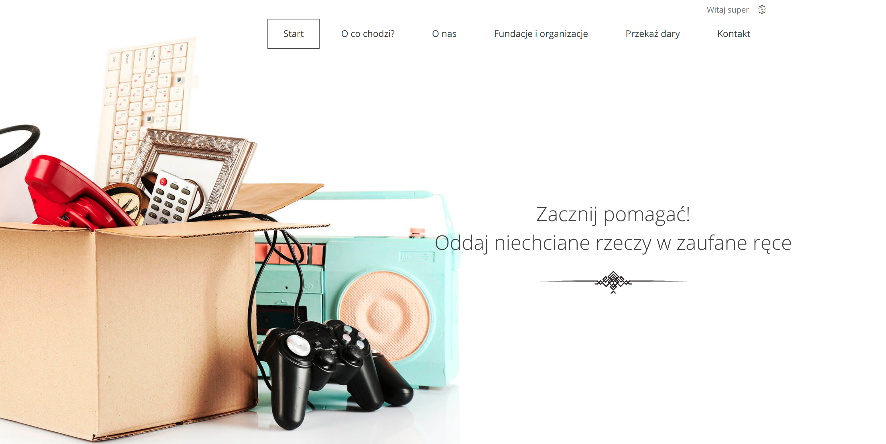

# Charity donation



The aim of the project is to create a place where everyone can donate unnecessary things to trusted institutions.

#### Where did the idea for the project come from?
The user has things at home that they want to get rid of, but do not know how.
There are many solutions available, but many of them require additional effort or are mistrusted. You have to go to the verified places, and there is no time / there is no way to go there, and the containers at home or local collections are unverified and it is not known whether these things will actually go to those in need.

### Start

To start exploring the project:
1. clone this repository
2. create the virtual environment and install requirements`pip install -r requirements.txt`
3. in the project directory create the file named ***local_settings.py*** and add there three below variables imported in `setting.py` file
   ```python
    from portfolio_lab.local_settings import DATABASES, EMAIL_HOST_USER, EMAIL_HOST_PASSWORD
    ```
   Example of ***local_settings.py***: 
   ```python
    DATABASES = {
        'default': {
            'ENGINE': 'django.db.backends.postgresql_psycopg2',
            'NAME': 'charity_donation',
            'USER': 'example',
            'PASSWORD': 'example',
            'HOST': 'localhost'
        }
    }

    EMAIL_HOST_USER = 'example'
    EMAIL_HOST_PASSWORD = 'example'
    ```

4. run the command `python manage.py migrate`
6. create a superuser to access the admin site: ` python manage.py createsuperuser`
8. that's all, run `python manage.py runserver` and enjoy :-)
